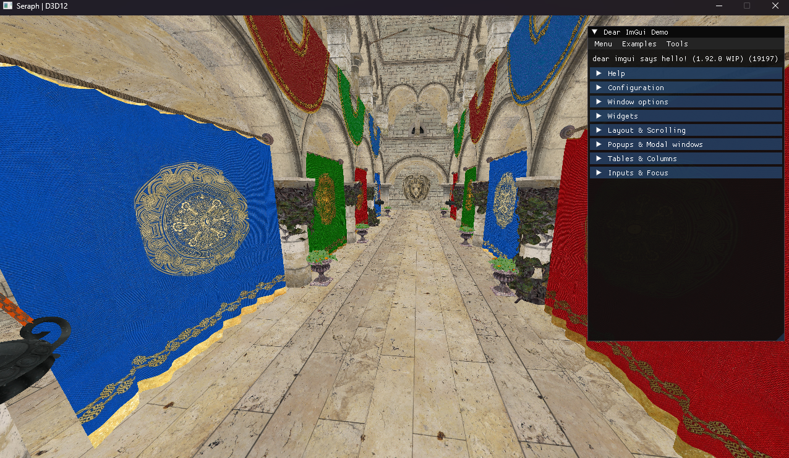
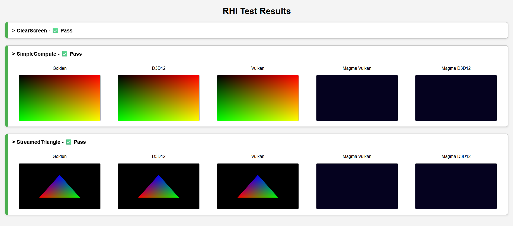

# Seraph : A showcase renderer for all my graphics programming skills

## Requirements

Minimum requirements is a SM6.6 capable GPU with raytracing and mesh shading capabilities, running Vulkan 1.3 and the latest version of D3D12.
The Vulkan backend requires VK_EXT_mutable_descriptor.

If you have an NVIDIA card, both backends are tested and thus work.
If you have an AMD or Intel card, you are recommended to use the D3D12 backend.

## Notable Features

- Complete RHI with D3D12/Vulkan support -- Bindless, raytracing, mesh shaders
- Test Suite for RHI -- Generates JSON report used to render results in simple web page
- Screenshot capture with GPU readback

## Screenshots

### Most recent screenshot of the demo app

### Test suite

