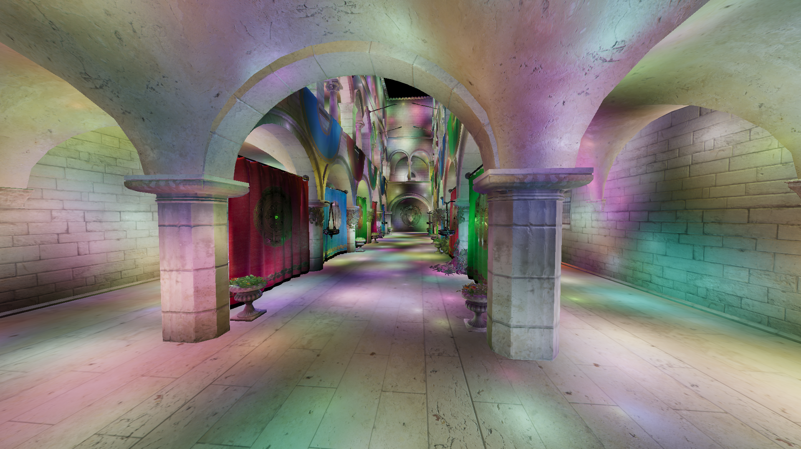
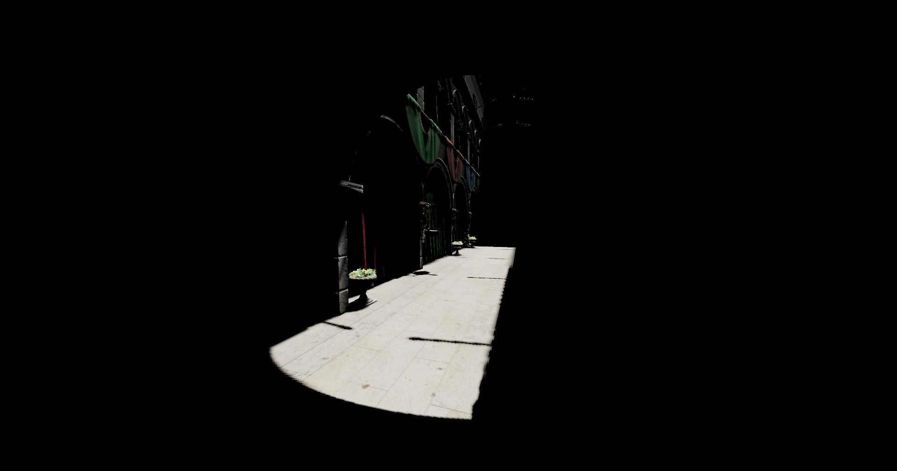

# Seraph : A showcase renderer for all my graphics programming skills, powered by the Kaleidoscope engine

## Requirements

Minspec for D3D12: GCN/Pascal.
Minspec for Vulkan: GCN/Turing. (Turing because of VK_EXT_mutable_descriptor)
This sample makes heavy use of raytracing.

## Building and running

This sample is built upon the [Kaleidoscope](https://github.com/Floating-Trees-Inc/Kaleidoscope) engine, that uses xmake as it's build system.\
Changing configs: `xmake f --mode={debug, release, releasedbg}`\
Building: `xmake`\
Running: `xmake run`\

## Disclaimer

If you have an NVIDIA card, both backends are tested and thus work.
It is currently **untested** on AMD and Intel cards since I do not have the hardware. However it is likely that it will not work.

## Screenshots

### Tiled Light Culling

### Shadows
| CSM | Hard RT | Soft RT (Ground Truth Denoised) |
|---------|---------|---------|
|  |  |  |

## Notable Features

- Techniques: Tiled light culling, deferred shading
- Lighting: Microfacet BRDF
- Shadows: CSM, Hard RT, Soft RT with 2 denoisers : (Ground-Truth, SVGF -- experimental)
- Tooling: Motion vector visualizer

## Planned

The Trello board for this project can be found [here](https://trello.com/b/s8naeZhw/kd-sp-rf).
- Bloom
- TAA
- Chromatic Aberration
- 6-pass Bokeh DOF
- Raytraced reflections
- Dynamic Diffuse Global Illumination
- Cluster culling & LODing via mesh shaders
- GPU particles
- Eye adaptation
- ReSTIR Local Shadows
- Pathtracer

# Known bugs

- Raytraced effects crashes when using RT pipeline on Vulkan backend
