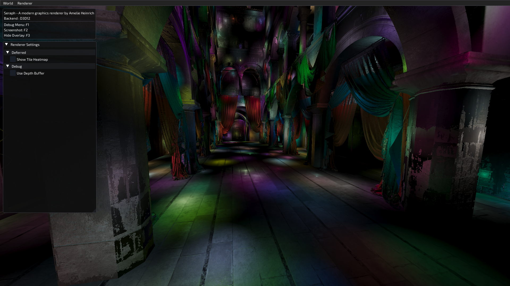
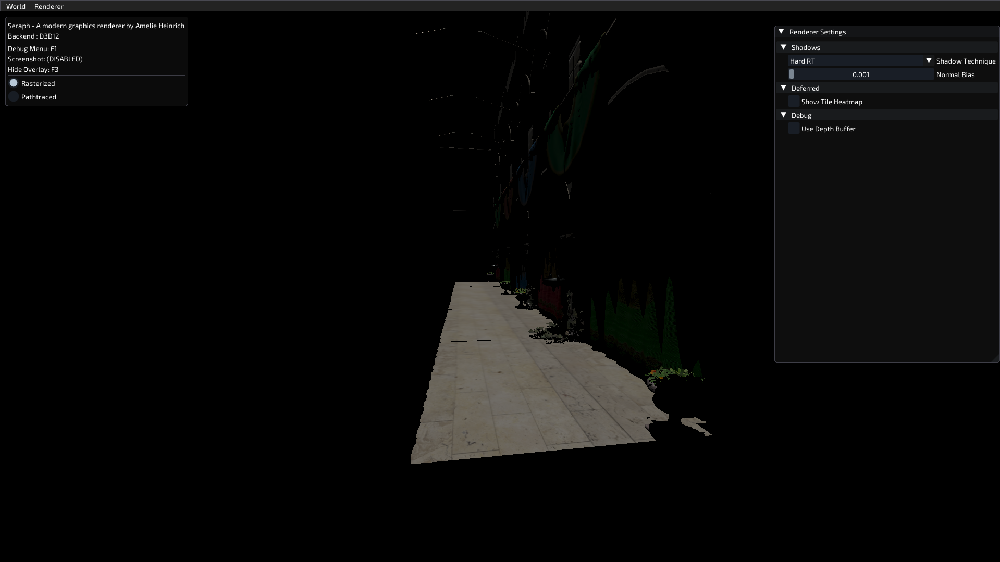
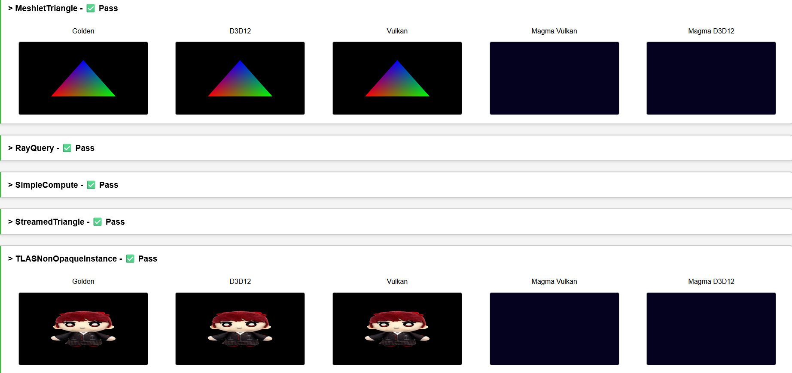

# Seraph : A showcase renderer for all my graphics programming skills

!! IMPORTANT : The current branch will not run in release mode due to a Slang bug !!

## Requirements

Minimum requirements is a SM6.6 capable GPU with raytracing and mesh shading capabilities, running Vulkan 1.3 and the latest version of D3D12.
The Vulkan backend requires VK_EXT_mutable_descriptor.

If you have an NVIDIA card, both backends are tested and thus work.
If you have an AMD or Intel card, you are recommended to use the D3D12 backend.

The Vulkan backend can be a bit finnicky depending on your GPU and is still experimental. You can try to use it, but if you just want to see what the renderer looks like, I recommend running the D3D12 backend.

## Screenshots

### Tiled Light Culling

### Raytraced Hard Shadows

### Test Suite

## Notable Features

- Complete RHI with D3D12/Vulkan support -- Bindless, raytracing, mesh shaders, GPU readback.
- Test Suite for RHI -- Generates JSON report used to render results in simple web page
- Asset compression and caching
- Techniques: Tiled light culling, deferred shading
- Lighting: Microfacet BRDF, CSM, raytraced hard shadows

## WIP

- Raytraced soft shadows
- SVGF denoising

## Planned

- Raytraced reflections
- Raytraced AO
- Dynamic Diffuse Global Illumination
- Cluster culling & LODing via mesh shaders
- Temporal Anti-Aliasing
- Bloom
- 6-pass Bokeh DOF
