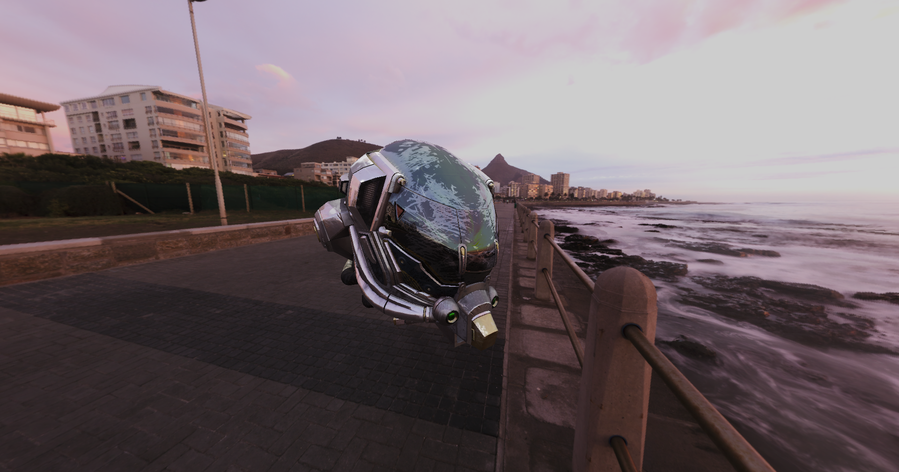

# Seraph : A showcase renderer for all my graphics programming skills, powered by the Kaleidoscope engine

## Requirements

Minspec for D3D12: GCN/Pascal.
Minspec for Vulkan: GCN/Turing.

## Building and running

This sample is built upon the [Kaleidoscope](https://github.com/Floating-Trees-Inc/Kaleidoscope) engine, that uses xmake as it's build system.\
Changing configs: `xmake f --mode={debug, release, releasedbg}`\
Building: `xmake`\
Running: `xmake run seraph`\

## Disclaimer

If you have an NVIDIA card, both backends are tested and thus work.
It is currently **untested** on AMD and Intel cards since I do not have the hardware. However it is likely that it will not work.

## Screenshots

### Tiled Light Culling

### Image based lighting

### Shadows
| CSM | Hard RT | Soft RT (Ground Truth Denoised) |
|---------|---------|---------|
|  |  |  |

## Notable Features

- Tiled light culling
- Deferred shading
- Microfacet BRDF
- Cascaded Shadow Maps
- Raytraced hard and soft shadows
- Baked image based reflections and GI
- Motion vector visualizer

## Planned

The Trello board for this project can be found [here](https://trello.com/b/s8naeZhw/kd-sp-rf).

## Known bugs

- Raytraced effects crashes when using RT pipeline on Vulkan backend
